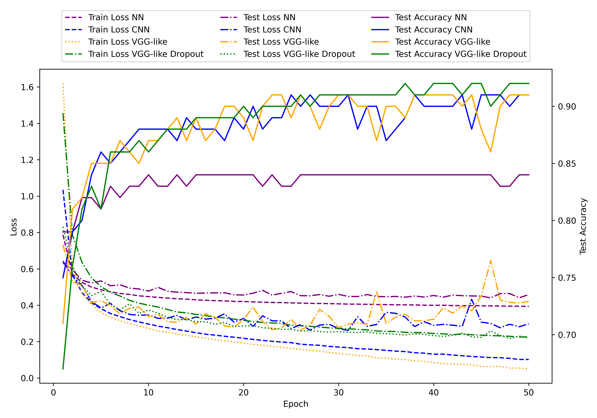

## fashion_nist NN.py

```
Using mps device
Epoch 1: Train Loss 0.7902, Test Loss 0.6491, Test Accuracy 77.92%
Epoch 2: Train Loss 0.5728, Test Loss 0.5696, Test Accuracy 81.10%
Epoch 3: Train Loss 0.5259, Test Loss 0.5488, Test Accuracy 81.09%
Epoch 4: Train Loss 0.5014, Test Loss 0.5178, Test Accuracy 82.31%
Epoch 5: Train Loss 0.4855, Test Loss 0.5264, Test Accuracy 81.89%
Epoch 6: Train Loss 0.4747, Test Loss 0.5334, Test Accuracy 81.63%
Epoch 7: Train Loss 0.4656, Test Loss 0.4950, Test Accuracy 82.93%
Epoch 8: Train Loss 0.4581, Test Loss 0.4891, Test Accuracy 83.16%
Epoch 9: Train Loss 0.4521, Test Loss 0.4903, Test Accuracy 83.08%
Epoch 10: Train Loss 0.4478, Test Loss 0.4962, Test Accuracy 82.38%
Epoch 11: Train Loss 0.4436, Test Loss 0.4772, Test Accuracy 83.38%
Epoch 12: Train Loss 0.4385, Test Loss 0.5132, Test Accuracy 82.39%
Epoch 13: Train Loss 0.4363, Test Loss 0.4738, Test Accuracy 83.30%
Epoch 14: Train Loss 0.4339, Test Loss 0.4741, Test Accuracy 83.46%
Epoch 15: Train Loss 0.4315, Test Loss 0.4846, Test Accuracy 83.04%
Epoch 16: Train Loss 0.4280, Test Loss 0.4744, Test Accuracy 83.26%
Epoch 17: Train Loss 0.4256, Test Loss 0.4753, Test Accuracy 83.01%
Epoch 18: Train Loss 0.4245, Test Loss 0.4687, Test Accuracy 83.31%
Epoch 19: Train Loss 0.4224, Test Loss 0.4592, Test Accuracy 83.75%
Epoch 20: Train Loss 0.4205, Test Loss 0.4651, Test Accuracy 83.51%
Epoch 21: Train Loss 0.4193, Test Loss 0.4677, Test Accuracy 83.31%
Epoch 22: Train Loss 0.4169, Test Loss 0.4665, Test Accuracy 83.31%
Epoch 23: Train Loss 0.4160, Test Loss 0.4532, Test Accuracy 84.13%
Epoch 24: Train Loss 0.4146, Test Loss 0.4577, Test Accuracy 84.13%
Epoch 25: Train Loss 0.4133, Test Loss 0.4604, Test Accuracy 83.95%
Epoch 26: Train Loss 0.4129, Test Loss 0.4563, Test Accuracy 84.21%
Epoch 27: Train Loss 0.4104, Test Loss 0.4572, Test Accuracy 83.95%
Epoch 28: Train Loss 0.4101, Test Loss 0.4567, Test Accuracy 83.79%
Epoch 29: Train Loss 0.4094, Test Loss 0.4530, Test Accuracy 83.98%
Epoch 30: Train Loss 0.4070, Test Loss 0.4629, Test Accuracy 83.88%
Epoch 31: Train Loss 0.4078, Test Loss 0.4503, Test Accuracy 84.02%
Epoch 32: Train Loss 0.4060, Test Loss 0.4509, Test Accuracy 84.27%
Epoch 33: Train Loss 0.4056, Test Loss 0.4483, Test Accuracy 84.16%
Epoch 34: Train Loss 0.4042, Test Loss 0.4496, Test Accuracy 84.32%
Epoch 35: Train Loss 0.4038, Test Loss 0.4456, Test Accuracy 84.32%
Epoch 36: Train Loss 0.4030, Test Loss 0.4450, Test Accuracy 84.45%
Epoch 37: Train Loss 0.4024, Test Loss 0.4520, Test Accuracy 84.20%
Epoch 38: Train Loss 0.4020, Test Loss 0.4550, Test Accuracy 84.23%
Epoch 39: Train Loss 0.4003, Test Loss 0.4579, Test Accuracy 83.78%
Epoch 40: Train Loss 0.3999, Test Loss 0.4544, Test Accuracy 83.99%
Epoch 41: Train Loss 0.3993, Test Loss 0.4566, Test Accuracy 84.06%
Epoch 42: Train Loss 0.3979, Test Loss 0.4452, Test Accuracy 84.32%
Epoch 43: Train Loss 0.3976, Test Loss 0.4645, Test Accuracy 83.90%
Epoch 44: Train Loss 0.3976, Test Loss 0.4461, Test Accuracy 84.37%
Epoch 45: Train Loss 0.3968, Test Loss 0.4415, Test Accuracy 84.50%
Epoch 46: Train Loss 0.3967, Test Loss 0.4885, Test Accuracy 83.08%
Epoch 47: Train Loss 0.3965, Test Loss 0.4746, Test Accuracy 82.82%
Epoch 48: Train Loss 0.3958, Test Loss 0.4492, Test Accuracy 84.15%
Epoch 49: Train Loss 0.3948, Test Loss 0.4463, Test Accuracy 84.20%
Epoch 50: Train Loss 0.3953, Test Loss 0.4424, Test Accuracy 84.42%
```


## fashion_nist CNN.py

- using mps

```
Using mps device
Epoch 1: Train Loss 1.0465, Test Loss 0.7630, Test Accuracy 68.79%
Epoch 2: Train Loss 0.5790, Test Loss 0.6002, Test Accuracy 76.76%
Epoch 3: Train Loss 0.4767, Test Loss 0.5225, Test Accuracy 80.50%
Epoch 4: Train Loss 0.4211, Test Loss 0.4259, Test Accuracy 84.51%
Epoch 5: Train Loss 0.3869, Test Loss 0.5016, Test Accuracy 80.02%
Epoch 6: Train Loss 0.3599, Test Loss 0.4397, Test Accuracy 83.49%
Epoch 7: Train Loss 0.3410, Test Loss 0.3759, Test Accuracy 86.08%
Epoch 8: Train Loss 0.3244, Test Loss 0.4093, Test Accuracy 84.96%
Epoch 9: Train Loss 0.3108, Test Loss 0.3843, Test Accuracy 86.14%
Epoch 10: Train Loss 0.2991, Test Loss 0.3951, Test Accuracy 85.74%
Epoch 11: Train Loss 0.2909, Test Loss 0.3164, Test Accuracy 88.34%
Epoch 12: Train Loss 0.2785, Test Loss 0.3194, Test Accuracy 88.53%
Epoch 13: Train Loss 0.2702, Test Loss 0.3163, Test Accuracy 88.37%
Epoch 14: Train Loss 0.2614, Test Loss 0.3128, Test Accuracy 88.20%
Epoch 15: Train Loss 0.2543, Test Loss 0.3239, Test Accuracy 88.10%
Epoch 16: Train Loss 0.2487, Test Loss 0.3056, Test Accuracy 88.98%
Epoch 17: Train Loss 0.2406, Test Loss 0.2977, Test Accuracy 89.32%
Epoch 18: Train Loss 0.2349, Test Loss 0.3042, Test Accuracy 88.84%
Epoch 19: Train Loss 0.2278, Test Loss 0.2990, Test Accuracy 89.20%
Epoch 20: Train Loss 0.2239, Test Loss 0.2972, Test Accuracy 89.30%
Epoch 21: Train Loss 0.2157, Test Loss 0.3634, Test Accuracy 86.09%
Epoch 22: Train Loss 0.2122, Test Loss 0.3282, Test Accuracy 88.20%
Epoch 23: Train Loss 0.2078, Test Loss 0.2976, Test Accuracy 89.29%
Epoch 24: Train Loss 0.2026, Test Loss 0.2828, Test Accuracy 89.94%
Epoch 25: Train Loss 0.1986, Test Loss 0.3200, Test Accuracy 88.35%
Epoch 26: Train Loss 0.1928, Test Loss 0.2672, Test Accuracy 90.59%
Epoch 27: Train Loss 0.1914, Test Loss 0.2665, Test Accuracy 90.57%
Epoch 28: Train Loss 0.1849, Test Loss 0.2734, Test Accuracy 90.30%
Epoch 29: Train Loss 0.1795, Test Loss 0.2731, Test Accuracy 90.57%
Epoch 30: Train Loss 0.1739, Test Loss 0.3049, Test Accuracy 88.78%
Epoch 31: Train Loss 0.1714, Test Loss 0.2859, Test Accuracy 89.34%
Epoch 32: Train Loss 0.1676, Test Loss 0.2774, Test Accuracy 90.33%
Epoch 33: Train Loss 0.1652, Test Loss 0.2767, Test Accuracy 90.31%
Epoch 34: Train Loss 0.1609, Test Loss 0.2884, Test Accuracy 89.95%
Epoch 35: Train Loss 0.1555, Test Loss 0.2924, Test Accuracy 90.11%
Epoch 36: Train Loss 0.1524, Test Loss 0.2991, Test Accuracy 89.71%
Epoch 37: Train Loss 0.1494, Test Loss 0.2741, Test Accuracy 90.74%
Epoch 38: Train Loss 0.1479, Test Loss 0.2809, Test Accuracy 90.60%
Epoch 39: Train Loss 0.1399, Test Loss 0.2929, Test Accuracy 90.12%
Epoch 40: Train Loss 0.1401, Test Loss 0.2734, Test Accuracy 90.71%
Epoch 41: Train Loss 0.1346, Test Loss 0.2808, Test Accuracy 90.80%
Epoch 42: Train Loss 0.1286, Test Loss 0.2868, Test Accuracy 90.38%
Epoch 43: Train Loss 0.1270, Test Loss 0.3227, Test Accuracy 89.68%
Epoch 44: Train Loss 0.1263, Test Loss 0.2753, Test Accuracy 90.76%
Epoch 45: Train Loss 0.1204, Test Loss 0.3151, Test Accuracy 89.57%
Epoch 46: Train Loss 0.1166, Test Loss 0.2994, Test Accuracy 90.63%
Epoch 47: Train Loss 0.1166, Test Loss 0.3530, Test Accuracy 88.91%
Epoch 48: Train Loss 0.1105, Test Loss 0.3190, Test Accuracy 90.39%
Epoch 49: Train Loss 0.1070, Test Loss 0.2882, Test Accuracy 90.99%
Epoch 50: Train Loss 0.1042, Test Loss 0.2997, Test Accuracy 90.49%
```

## fashion_nist VGG_like.py

- using mps

- using dropout (no)
```
Using mps device
Epoch 1: Train Loss 2.0595, Test Loss 1.5895, Test Accuracy 49.81%
Epoch 2: Train Loss 0.7010, Test Loss 0.7166, Test Accuracy 73.53%
Epoch 3: Train Loss 0.4825, Test Loss 0.7495, Test Accuracy 68.37%
Epoch 4: Train Loss 0.4165, Test Loss 0.4824, Test Accuracy 81.34%
Epoch 5: Train Loss 0.3746, Test Loss 0.3886, Test Accuracy 86.10%
Epoch 6: Train Loss 0.3428, Test Loss 0.3772, Test Accuracy 86.32%
Epoch 7: Train Loss 0.3222, Test Loss 0.3938, Test Accuracy 85.60%
Epoch 8: Train Loss 0.3005, Test Loss 0.3509, Test Accuracy 87.39%
Epoch 9: Train Loss 0.2853, Test Loss 0.3347, Test Accuracy 87.94%
Epoch 10: Train Loss 0.2712, Test Loss 0.3528, Test Accuracy 87.15%
Epoch 11: Train Loss 0.2594, Test Loss 0.4091, Test Accuracy 85.68%
Epoch 12: Train Loss 0.2489, Test Loss 0.3296, Test Accuracy 88.49%
Epoch 13: Train Loss 0.2386, Test Loss 0.2924, Test Accuracy 89.43%
Epoch 14: Train Loss 0.2285, Test Loss 0.2967, Test Accuracy 89.01%
Epoch 15: Train Loss 0.2203, Test Loss 0.3502, Test Accuracy 87.41%
Epoch 16: Train Loss 0.2121, Test Loss 0.2858, Test Accuracy 89.58%
Epoch 17: Train Loss 0.2055, Test Loss 0.2920, Test Accuracy 90.11%
Epoch 18: Train Loss 0.1965, Test Loss 0.2843, Test Accuracy 89.59%
Epoch 19: Train Loss 0.1897, Test Loss 0.2869, Test Accuracy 89.70%
Epoch 20: Train Loss 0.1840, Test Loss 0.2708, Test Accuracy 90.53%
Epoch 21: Train Loss 0.1770, Test Loss 0.3522, Test Accuracy 87.56%
Epoch 22: Train Loss 0.1707, Test Loss 0.3297, Test Accuracy 88.59%
Epoch 23: Train Loss 0.1645, Test Loss 0.2875, Test Accuracy 90.11%
Epoch 24: Train Loss 0.1590, Test Loss 0.2717, Test Accuracy 90.80%
Epoch 25: Train Loss 0.1500, Test Loss 0.2960, Test Accuracy 90.03%
Epoch 26: Train Loss 0.1448, Test Loss 0.3333, Test Accuracy 89.02%
Epoch 27: Train Loss 0.1393, Test Loss 0.2997, Test Accuracy 90.86%
Epoch 28: Train Loss 0.1327, Test Loss 0.3301, Test Accuracy 88.92%
Epoch 29: Train Loss 0.1266, Test Loss 0.2954, Test Accuracy 90.72%
Epoch 30: Train Loss 0.1205, Test Loss 0.3341, Test Accuracy 89.19%
Epoch 31: Train Loss 0.1158, Test Loss 0.3203, Test Accuracy 90.23%
Epoch 32: Train Loss 0.1082, Test Loss 0.3452, Test Accuracy 89.76%
Epoch 33: Train Loss 0.1060, Test Loss 0.3050, Test Accuracy 90.90%
Epoch 34: Train Loss 0.0983, Test Loss 0.3534, Test Accuracy 89.91%
Epoch 35: Train Loss 0.0963, Test Loss 0.3432, Test Accuracy 90.59%
Epoch 36: Train Loss 0.0909, Test Loss 0.4445, Test Accuracy 87.12%
Epoch 37: Train Loss 0.0849, Test Loss 0.4040, Test Accuracy 89.05%
Epoch 38: Train Loss 0.0797, Test Loss 0.4340, Test Accuracy 88.92%
Epoch 39: Train Loss 0.0758, Test Loss 0.3924, Test Accuracy 90.78%
Epoch 40: Train Loss 0.0759, Test Loss 0.6448, Test Accuracy 86.78%
Epoch 41: Train Loss 0.0675, Test Loss 0.4011, Test Accuracy 90.69%
Epoch 42: Train Loss 0.0677, Test Loss 0.3961, Test Accuracy 90.75%
Epoch 43: Train Loss 0.0563, Test Loss 0.4427, Test Accuracy 90.19%
Epoch 44: Train Loss 0.0561, Test Loss 0.5779, Test Accuracy 89.18%
Epoch 45: Train Loss 0.0527, Test Loss 0.4632, Test Accuracy 90.18%
Epoch 46: Train Loss 0.0526, Test Loss 0.4728, Test Accuracy 89.97%
Epoch 47: Train Loss 0.0442, Test Loss 0.5376, Test Accuracy 89.52%
Epoch 48: Train Loss 0.0475, Test Loss 0.4596, Test Accuracy 90.69%
Epoch 49: Train Loss 0.0393, Test Loss 0.5546, Test Accuracy 90.00%
Epoch 50: Train Loss 0.0364, Test Loss 0.5747, Test Accuracy 88.55%
```

- using dropout (yes)

```
Using mps device
Epoch 1: Train Loss 1.5869, Test Loss 0.8170, Test Accuracy 70.20%
Epoch 2: Train Loss 0.7859, Test Loss 0.5706, Test Accuracy 79.49%
Epoch 3: Train Loss 0.6165, Test Loss 0.5006, Test Accuracy 81.46%
Epoch 4: Train Loss 0.5447, Test Loss 0.4684, Test Accuracy 82.30%
Epoch 5: Train Loss 0.5035, Test Loss 0.4687, Test Accuracy 80.70%
Epoch 6: Train Loss 0.4718, Test Loss 0.3876, Test Accuracy 85.47%
Epoch 7: Train Loss 0.4460, Test Loss 0.3694, Test Accuracy 86.48%
Epoch 8: Train Loss 0.4230, Test Loss 0.3702, Test Accuracy 86.01%
Epoch 9: Train Loss 0.4055, Test Loss 0.3825, Test Accuracy 85.31%
Epoch 10: Train Loss 0.3945, Test Loss 0.3451, Test Accuracy 87.04%
Epoch 11: Train Loss 0.3792, Test Loss 0.3359, Test Accuracy 87.54%
Epoch 12: Train Loss 0.3738, Test Loss 0.3204, Test Accuracy 88.14%
Epoch 13: Train Loss 0.3604, Test Loss 0.3242, Test Accuracy 87.88%
Epoch 14: Train Loss 0.3509, Test Loss 0.2964, Test Accuracy 88.94%
Epoch 15: Train Loss 0.3431, Test Loss 0.2957, Test Accuracy 89.03%
Epoch 16: Train Loss 0.3360, Test Loss 0.2934, Test Accuracy 88.96%
Epoch 17: Train Loss 0.3273, Test Loss 0.2839, Test Accuracy 89.52%
Epoch 18: Train Loss 0.3202, Test Loss 0.3405, Test Accuracy 87.40%
Epoch 19: Train Loss 0.3139, Test Loss 0.3100, Test Accuracy 88.25%
Epoch 20: Train Loss 0.3084, Test Loss 0.2744, Test Accuracy 89.78%
Epoch 21: Train Loss 0.3017, Test Loss 0.2699, Test Accuracy 90.22%
Epoch 22: Train Loss 0.2999, Test Loss 0.2650, Test Accuracy 90.29%
Epoch 23: Train Loss 0.2935, Test Loss 0.3015, Test Accuracy 88.51%
Epoch 24: Train Loss 0.2932, Test Loss 0.2588, Test Accuracy 90.41%
Epoch 25: Train Loss 0.2858, Test Loss 0.2799, Test Accuracy 89.40%
Epoch 26: Train Loss 0.2795, Test Loss 0.2531, Test Accuracy 90.71%
Epoch 27: Train Loss 0.2792, Test Loss 0.2698, Test Accuracy 89.81%
Epoch 28: Train Loss 0.2735, Test Loss 0.2474, Test Accuracy 90.89%
Epoch 29: Train Loss 0.2709, Test Loss 0.2437, Test Accuracy 90.76%
Epoch 30: Train Loss 0.2675, Test Loss 0.2419, Test Accuracy 90.95%
Epoch 31: Train Loss 0.2642, Test Loss 0.2547, Test Accuracy 90.54%
Epoch 32: Train Loss 0.2597, Test Loss 0.2405, Test Accuracy 91.22%
Epoch 33: Train Loss 0.2586, Test Loss 0.2330, Test Accuracy 91.54%
Epoch 34: Train Loss 0.2580, Test Loss 0.2647, Test Accuracy 90.16%
Epoch 35: Train Loss 0.2542, Test Loss 0.2441, Test Accuracy 91.20%
Epoch 36: Train Loss 0.2517, Test Loss 0.2300, Test Accuracy 91.62%
Epoch 37: Train Loss 0.2465, Test Loss 0.2368, Test Accuracy 91.40%
Epoch 38: Train Loss 0.2457, Test Loss 0.2288, Test Accuracy 91.75%
Epoch 39: Train Loss 0.2418, Test Loss 0.2373, Test Accuracy 91.01%
Epoch 40: Train Loss 0.2421, Test Loss 0.2338, Test Accuracy 91.39%
Epoch 41: Train Loss 0.2378, Test Loss 0.2368, Test Accuracy 91.49%
Epoch 42: Train Loss 0.2335, Test Loss 0.2373, Test Accuracy 91.25%
Epoch 43: Train Loss 0.2355, Test Loss 0.2407, Test Accuracy 91.18%
Epoch 44: Train Loss 0.2315, Test Loss 0.2293, Test Accuracy 91.65%
Epoch 45: Train Loss 0.2303, Test Loss 0.2388, Test Accuracy 90.89%
Epoch 46: Train Loss 0.2288, Test Loss 0.2215, Test Accuracy 91.93%
Epoch 47: Train Loss 0.2255, Test Loss 0.2214, Test Accuracy 92.15%
Epoch 48: Train Loss 0.2260, Test Loss 0.2436, Test Accuracy 91.02%
Epoch 49: Train Loss 0.2255, Test Loss 0.2177, Test Accuracy 91.98%
Epoch 50: Train Loss 0.2226, Test Loss 0.2208, Test Accuracy 91.69%
```



